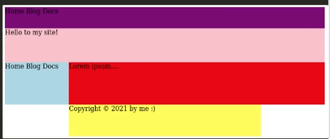

# Challenge 001

## Problem:

- You are asked to write a simple website template based on a CSS grid layout.

- Requirements

  - 1. Make `container` the main `grid` component.
  - 2. Define `grid-template-areas` to match the following sepcification:
    - 1. Style the `navbar` so that it uses the full width of the page and `50px` height.
    - 2. Style the `hero` so that it uses full width and `80px` height.
    - 3. Style the `sidebar` so that it uses 1/5 of the width and has automatic height of not less than `100px`.
    - 4. Style the `content` so that it uses the remaining 4/5 of the width and has the same height as `sidebar`.
    - 5. Style the `footer` so that it uses 3/5 of the width and `75px` height and is centered.

- Assumptions

  - The elements you are asked to style on the web page are structured as follows:
    ```html
    <div class="container">
      <div class="navbar"></div>
      <div class="hero"></div>
      <div class="sidebar"></div>
      <div class="content"></div>
      <div class="footer"></div>
    </div>
    ```

- Hints

  - Colors in the initial code are there just to help you recognize the sections in the preview; you can modify them as you wish, as they are not assessed.

- Examples

  - Your final result should look like the following image:

    

```css
.container {
}

.navbar {
  background-color: purple;
}
.hero {
  background-color: pink;
}
.content {
  background-color: red;
}
.sidebar {
  background-color: lightblue;
}
.footer {
  background-color: yellow;
}
```
